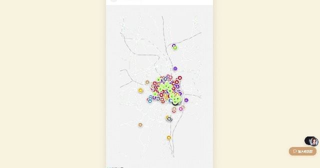
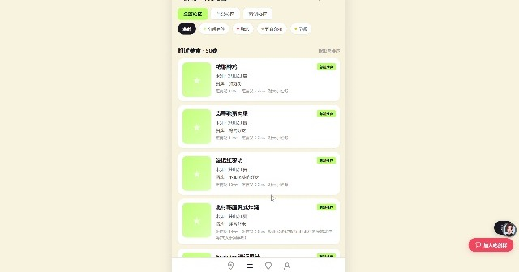
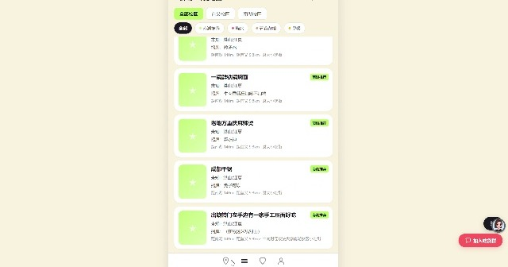
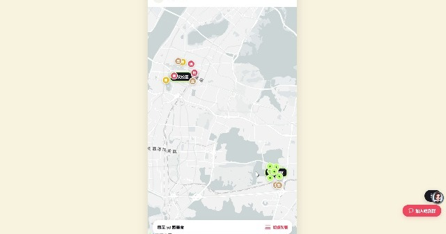

<div align="center">
  <br>
  
  <br>
  <br>
  <h1>🍜 鲜城 · 味觉地图</h1>
  <p><b>武汉美食地图 · 新生吃喝玩乐指南</b></p>
  <p>
    <a href="https://illustrious-croissant-8adc7b.netlify.app" target="_blank">
      <b>🌐 在线体验</b>
    </a>
  </p>
  <br>
</div>

<div align="center">


</div>

---

## 📸 预览

<div align="center">
  <table>
    <tr>
      <td></td>
      <td></td>
      <td></td>
    </tr>
    <tr align="center">
      <td>入口页</td>
      <td>财大周边列表</td>
      <td>店铺详情</td>
    </tr>
    <tr>
      <td></td>
      <td></td>
      <td></td>
    </tr>
    <tr align="center">
      <td>财大校园地图</td>
      <td>武汉全城地图</td>
      <td>全城分类筛选</td>
    </tr>
  </table>
</div>

---

## ✨ 功能

| | 功能 | 说明 |
|---|---|---|
| 🗺️ | **双模式地图** | 财大周边版 + 武汉全城版，覆盖不同场景 |
| 📍 | **高德地图集成** | Marker 聚合、信息窗口、一键导航到店 |
| 🔍 | **多维筛选** | 按分类/区域/价格/距离/评分筛选排序 |
| 📝 | **店铺详情** | 店名、分类、人均、招牌菜、推荐理由 |
| ⭐ | **必吃标记** | 数据标注"必吃"标签，一目了然 |
| ❤️ | **收藏功能** | 本地保存，离线可用 |
| 🔗 | **分享链接** | 一键复制，快速分享给同学 |
| 💬 | **社群导流** | 悬浮按钮引导加入吃喝玩乐群 |

---

## 📦 数据

覆盖 **540+ 家武汉美食店铺**，来源：

- **武汉美食地图 2024** — 传统武汉老店 ~470 家（含早餐、烧烤、火锅、日料、甜点等 16 个分类）
- **南湖美食图鉴** — 财大周边推荐 69 家（小吃街宝藏店）
- 所有地址已通过 **高德地图 API** 地理编码（GCJ-02）

### 校区覆盖

| 校区 | 范围 | 店铺数 |
|------|------|--------|
| 🏫 首义校区 | 边界外扩 1km | 8 家 |
| 🏫 南湖校区 | 边界外扩 1km | 42 家 |
| 🏙️ 武汉全城 | 三镇全覆盖 | 540+ 家 |

---

## 🛠️ 技术栈

```
📄 前端    纯静态 HTML + CSS + JavaScript
🗺️ 地图    高德地图 JS API 2.0（GCJ-02 坐标系）
📊 分析    自定义埋点框架（可接入百度统计）
🚀 托管    Netlify（国内可访问）
📦 源码    GitHub（自动触发 Netlify 部署）
```

---

## 🚀 本地运行

```bash
# 克隆项目
git clone https://github.com/Robin-fang611/wuhan-food-map.git
cd wuhan-food-map

# 直接用浏览器打开
open index.html
# 或启动本地服务器
python -m http.server 8080
# 访问 http://localhost:8080
```

> 地图功能需要配置高德地图 JS API Key，在 `js/config.js` 中填入。

---

## 🧑‍💻 贡献

欢迎提交 Issue 或 PR！如果你想：

- 🍜 **推荐新店铺** — 提交 Issue，附上店名和地址
- 🐛 **报告 Bug** — 提交 Issue 描述问题
- ⭐ **支持项目** — 点个 Star，让更多同学看到

---

## 📄 License

[MIT](LICENSE)

---

<div align="center">
  <br>
  <p>
    <b>鲜城 · 味觉地图</b><br>
    发现武汉好味道
  </p>
  <p>
    <a href="https://illustrious-croissant-8adc7b.netlify.app" target="_blank">🌐 在线体验</a>
    ·
    <a href="https://github.com/Robin-fang611/wuhan-food-map/issues" target="_blank">💬 反馈建议</a>
  </p>
  <br>
</div>
