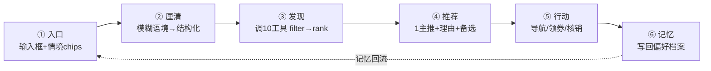

# 蛮有味 · 美食发现 Agent —— 产品技术规格（SPEC）

> **本文定位**：项目**唯一事实来源（Single Source of Truth）**。所有代码、规划、验收、对外沟通均以本文为准。
> **版本**：v2.0（2026-08-15 起生效）· **作者**：Robin + AI · **维护**：守门智能体按本文 §11 推进。
> **v2.0 重构说明**：按智能体产品标准重排结构——新增「用户与场景」「智能体行为规范」「指标与成功标准」章节；保留全部既定事实与决策（v1.0 内容未丢失）。2026-08-15 Robin 三项拍板已入册：V4.4 数据统一授权、下一步顺序 S2→S6、GitHub 推送授权（见 §12）。

---

## 0. 本文与配套文档

| 文档 | 角色 | 状态 |
|------|------|------|
| **docs/SPEC.md（本文件）** | 唯一事实来源：定位 / 架构 / 里程碑 / 验收 / 风险 / 下一步 | 现行（v2.0） |
| docs/README.md | 文档索引（指向本文件与保留文档） | 现行 |
| docs/status-2026-08-15.md | 实查状态快照（源码核查，非 roadmap 勾选） | 现行（点状记录，随 §11 更新） |
| docs/BFF接口契约.md | RewardStore 后端契约（BFF 落地唯一依据，V4.1 延后项） | 现行 |
| docs/高德Key安全接入.md | 高德 Key 安全红线与后端代理方案 | 现行 |
| docs/ranking-audit.md | 反广告排序审计（可重跑，PASS 结论） | 现行（自动生成） |
| docs/datasource-reconcile.md | 数据源口径核对（857 vs 625，可重跑） | 现行（自动生成） |
| docs/collect-visit-guide.md | 探店采集：用户上传店铺 + 高德校验入库流程 | 现行（见 §11 S5） |
| hypha/*.md（PRODUCT-VISION / PRODUCT-REQUIREMENTS / MONETIZATION-MODEL / ARCHITECTURE / ITERATION-LOG） | 智能体技术规格与演进日志 | 现行（Agent 专属，补充本文件） |
| .context-store/（CONTROL_TOWER + layers/ + handoffs/） | 会话接棒上下文库（控制塔导航，细节在 layers/） | 现行 |

---

## 1. 产品定位与价值主张

### 1.1 一句话定位
- **产品**：蛮有味（Manyouwei）—— 武汉 & 财大周边的 **AI 美食发现 Agent**。
- **一句话**：「今天吃啥？问蛮有味。」—— 你说一句偏好（心情 / 预算 / 和谁吃 / 片区），它用真探过的店给你**一个主推 + 2~3 备选，每家都带为什么**。

### 1.2 Job to be Done
> 当一个大学生站在饭点、又累又饿又选择疲劳时，**快速、放心地决定「今天吃啥」**——不踩雷、不超预算、适配当下场景（一个人 / 约会 / 宿舍聚餐）。

- **高频、低客单、强情境**的决策，不是「找一家好馆子」的信息检索。
- 辅助决策 ≠ 替代决策：产品给主推 + 理由，**最终拍板权永远在用户**。
- 价值主张：把人「照亮 / 收窄」，让人更快更敢做决定。

### 1.3 与平台的差异
不做又一个大众点评 / 小红书 / 美团。核心差异点：
1. **替你决策**（1 主推 + 理由，而非长列表）；
2. **可解释**（每张卡写明「为什么推荐这家」，推理时间线可展开）；
3. **反广告且可验证**（排序不出卖，可静态审计）；
4. **越用越懂你**（口味档案记忆，本地 + 后端化）。

### 1.4 信任内核（不可动摇）
- **推荐排序不出卖**：排序与入选只由信任信号（评分 / 距离 / 人均 / 真实点评 / 场景）与用户意图决定，**绝不**因任何商户付费或分润关系改变。可验证（见 §3.7、§8）。
- 这不是「绝不商业化」，是「商业化不污染排序」。

### 1.5 当前形态
纯前端 H5（Vite 原生 JS，零运行时依赖）+ 自有 Node 后端（:8799）跑 LLM；账号体系（图形码 + 短信 + JWT + 微信）已接真后端；券 / 核销为前端原型（localStorage），BFF 化延后（见 §11 后置项）。

---

## 2. 用户与场景

### 2.1 目标用户
- **主用户（Primary）**：财大南湖周边学生（大一、大二为主）与周边食客——高频、预算敏感、社交场景丰富。
- **扩展用户**：武汉全城（先窄后宽，数据密度高、冷启动便宜）。
- **战场**：校园 Local 生活（窄而深，跑通后再扩全市）。

### 2.2 核心场景与用户故事

| # | 场景 | 用户故事 | 对应 Agent 能力 |
|---|------|----------|----------------|
| U1 | 日常单人（高频） | 「今天累瘫了想吃近的，不想走动」 | 情境意图 → 就近筛选 → 主推 + 理由 |
| U2 | 宿舍聚餐 | 「4 个人晚上聚餐，人均别超 60」 | 预算 + 场景 + 容量约束 → 推荐 |
| U3 | 约会 | 「带暗恋的人第一次吃饭，别太寒酸」 | 情绪 / 场合语境 → 场景合适推荐 |
| U4 | 夜宵 | 「财大南湖周边便宜的宵夜」 | 时段 + 价格约束 → 宵夜榜单 |
| U5 | 情绪进食 | 「心情不好想吃点治愈系暖暖的」 | 无字段可映射的模糊语境 → LLM 翻译成筛选约束 |
| U6 | 到店行动 | 「这家怎么去？有券吗？」 | 导航 / 领券 / 核销一键衔接 |

> **已证（Phase 5 盲评）**：情境 / 情绪意图子集（15 条）LLM「懂我」胜率 100% vs 规则 13%；决策完成率 LLM 100% vs 规则 13% —— **LLM 楔子定量成立**（H1 未被证伪），架构赌注坐实。

---

## 3. 智能体行为规范（Agent Behavior Specification）

> 本章定义 Agent 的产品行为——用户可感知的对话回路、工具使用规则、记忆模型、输出契约、降级策略。引擎实现见 hypha/implementation/src/。

### 3.1 对话回路（产品层 6 态闭环）



- **Intake 就是主页**：首页形态 = 对话优先（B 形态，Robin 拍板）——输入框 +「今天想吃啥？」+ 情境快捷 chips（心情不好 / 想省钱 / 带人吃饭 / 不知道吃啥）；顶部一条确定性入口（常去 / 收藏 / 附近）缓解冷启动空屏。
- 多轮追问必须支持：换一家 / 再便宜点 / 换个附近（短期会话记忆累积意图）。

### 3.2 引擎层 FSM（orchestrator.js 确定性实现，供 /run）
6 状态：Intake → Parse → Discover → Reason → Finalize → Completed。每条运行产出 processHash 可回放审计。

### 3.3 工具使用规则（10 领域工具）

| # | 工具 id | 副作用 | 职责 | 权限 |
|---|---------|--------|------|------|
| 1 | discover.filter | read | 按 zone/category/mealTime/maxPrice/keyword 筛选 | 匿名可调 |
| 2 | discover.rank | read | 榜单（必吃 / 性价比 / 宵夜 / 新店），limit 截断 | 匿名可调 |
| 3 | discover.detail | read | 商户详情 + 距离 + 理由 + 推荐菜 | 匿名可调 |
| 4 | discover.geo | read | 距离计算与就近排序（CAMPUS_COORDS，不伪造坐标） | 匿名可调 |
| 5 | discover.navigate | read | 公开 uri.amap.com 导航 URL（无 Key；缺坐标返回 null） | 匿名可调 |
| 6 | user.favorite | write | 收藏 / 取消收藏 / list（幂等；**JWT 鉴权，服务端从 token 解析本人，忽略客户端 userId**；持久化 favorites.json） | 本人（需登录） |
| 7 | reward.checkin | write | 签到得券（同日幂等） | 本人 |
| 8 | reward.view-wallet | read | 本人券包（已得 / 已核销 / 已过期） | 仅本人 |
| 9 | reward.claim | write | 领券（每商家每用户限 1 张，幂等） | 本人 |
| 10 | analytics.track | read | 埋点（sanitize 递归剥离 PII） | 匿名 |

- **调用纪律**：模型经 facade 调工具，只拿投影候选集，不直接触原始数据；模型输出不可信 → resolveDecision 校验商户 id 存在性，幻觉 id 丢弃 → 红线校验 redlineCheck → 装配 output.food-recommendation。
- **体验纪律（2026-08-13 盲评修复后固化进提示词）**：距离一致明示 / 必给可执行出口（导航·领券·核销）/ 禁绝对化用词 / 禁凑无关项。

### 3.4 记忆模型
- **短期（会话内）**：本次对话意图累积，支持多轮追问。
- **长期（口味档案）**：辣度 / 预算带 / 忌口 / 常去 zone / 收藏，存自有后端 /memory/:sessionId（后端化、去标识化），不落前端包。
- **隐私红线**：口味档案是「行为推导」不是「身份」，**不采集姓名 / 学号 / 手机号**（PII 红线）；用户可一键清除。

### 3.5 决策输出契约（推荐态）
- **不是 10 家列表**，是：「**1 个主推 + 一句话理由（为什么适合你此刻状态）+ 2~3 个备选 + 一键导航 / 领券 / 核销**」。
- 主推**必须可解释**（factors + scoreBreakdown 权重拆解）+ **承认不知道**（无匹配时明说、不编造）——信任来自可解释 + 诚实。
- 排序永不被出价影响；CPS 仅在用户选定后于渲染层后挂（见 §3.7）。

### 3.6 降级与熔断
- LLM 不可用 / 超时 / 5xx / 红线触发 → AgentFallbackError → 自动回退确定性 /run，出参契约不变（fallback=true / degradation:'llm->rule'），**前端无感**。
- 双脑可切换：前端 setBackend('server' | 'local') 零改动切 LLM 大脑 / 本地规则大脑；两者都走 :8799，仅端点不同（/agent vs /run）。

### 3.7 信任内核技术落地（反广告防火墙）
- CPS 商户签约集合（cps.js）**只决定卡片是否挂「可核销优惠」展示标**，**绝不被** discovery-engine / intent-parser / filter / rank / orchestrator 导入；排序从不读取该集合；不影响入选或位置。
- 系统提示明确「排序只基于信任信号，绝不因付费 / 分润改变」。
- 审计脚本 scripts/ranking-audit.mjs 可重跑，结论 PASS（零商业加权命中，2026-08-13）。
- 声明：**蛮有味的推荐排序不出卖（zero sponsored weight）**。营收（CPS 分润）与排序正交，仅在结果生成后以展示标呈现，且默认无真实签约商户（诚实留空，待真实签约后填 env）。

---

## 4. 系统架构

### 4.1 总体拓扑
```
浏览器 H5 (Vite 原生 JS, 零依赖)
   ├─ 首页意图栏 (home.js) ──goReasoning──▶ 推理页 (reasoning.js)
   │                                          │  L3 集成层 agent-client.js
   │                                          ▼  HTTP (CORS)
   │                         自有 Node 后端 :8799 (hypha/implementation)
   │                           ├─ POST /run   确定性 FSM (Intake→Discover→Completed)
   │                           │                → output.food-recommendation (0 token)
   │                           ├─ POST /agent  LLM 大脑 (DeepSeek ReAct tool_calling)
   │                           │                LLM 不可用 → 自动降级 /run (前端无感)
   │                           ├─ POST /tools/:id  单工具调用 (10 领域工具 adapter)
   │                           ├─ /memory/:sid     后端化口味档案 (去标识化偏好)
   │                           ├─ POST /upload     探店采集 (高德校验三分支)
   │                           ├─ /auth/*          账号体系 (图形码+短信+JWT+微信)
   │                           └─ DeepSeek API (Key 仅服务端 env)
   │
   └─ 数据访问：RewardStore 抽象 (LocalStore 默认 / BffStore 预留 v1.5)
```

### 4.2 组件职责
- **orchestrator.js**：确定性 FSM 编排（/run）。
- **agent-loop.js**：ReAct 循环（/agent）——收自然语言 → DeepSeek tool_calling → 调 facade 工具 → finalize_recommendation（1 主推 + 2~3 备选 + 理由 + 导览）；模型输出不可信 → resolveDecision 校验 → redlineCheck → 装配契约。
- **auth-server.js**：图形验证码（自绘 SVG，一次性、5 分钟、常量时间比对）+ 短信验证码（频控 1 分钟 1 次 / 1 小时 ≤5 / 24 小时 ≤10；6 位、10 分钟、一次性）+ JWT（HMAC-SHA256 内联签发，零依赖，30 天）+ 微信网页授权。**存储（S3 起）：账号文件持久化（data/auth-users.json，gitignored、原子写 tmp+rename），重启不丢账号、旧 JWT 仍有效；验证码 / 频控为内存态（短时效安全语义）；生产可平滑换 Redis/DB（接口不变）**。
- **upload.js**：探店采集三分支（高德搜到→verified；摊类描述→verified_stall；其余→pending）+ 相关性闸门（店名相似度 ≥0.5 且定位 3km 内）。
- **datasource/**：FoodDataSource 抽象 + 注册表（sample 默认 / wuhan opt-in）。
- **explain.js / provenance.js**：逐店理由 + 因子权重 + 溯源（processHash / fsm / prompts / trace.steps 可回放）。

### 4.3 前端（h5）工程约束
- 主流程：列表 → 详情 → 领券 → 券包 / 收藏 → 到店核销 CPS，全通且有测试。
- 信任内核 UI：因子权重可视化、真实性徽章（verified 绿 / partial 金 / estimated 灰）、反广告审计、探店采集工具，均真实实现。
- 工程约束：引擎 / 纯逻辑在 core/、plays/；UI 在 ui/ 且**必须用 dom.js 的 h() 构建 DOM，禁止 innerHTML 拼动态内容**；视觉只用 styles/tokens.css 变量（蛮有味色板）。

---

## 5. 数据规范

### 5.1 商户数据契约（runtime.projectMerchant 投射）
字段（缺省显式 null，不编造）：
id, name, zone, category, cuisine, mealTime[], avgPrice(string), avgPriceNum(number), rating, signatureDishes, recommendDishes[], taste, tasteTags[], environment, environmentRating, serviceRating, ratingNum, hours, tel, occasions[], tags[], waitTime, reviewSummary, imageEmoji, address, lng, lat, distanceKm, has_coupon, coupon_summary, source, dataConfidence('verified'|'estimated'|'partial'), needsEnrichment(bool), enrichedAt, editorReason

### 5.2 置信度分级（诚实标注，不编造）
| 等级 | 含义 | 当前数量（2026-08-15 S2 统一口径实测） |
|------|------|------------------------------|
| verified | 真实核验（实地 / 高德 / 联网核验） | 41 |
| partial | 部分核验 | 1 |
| estimated | 按品类算法推导，待探店升级 | 525 |
| undefined | robin-99 / web-stalls 未标注（诚实不编造，前端按 estimated 展示） | 293 |

### 5.3 数据源抽象
- FoodDataSource 基类 + 注册表；sample（默认 7 条合成）+ wuhan（opt-in，ALL_MERCHANTS）。
- 切换：setDefaultDataSource(createDataSource('wuhan')) 或 env MYWO_DATASOURCE=wuhan。

### 5.4 数据治理规则（V4.4，2026-08-15 已授权 · S2 已完成）
- **统一后口径（2026-08-15 实测）**：merchants.js=567（原始表，58 组真重复合并 + 3 组分店改名保留，重名 0）；双端（前端 allMerchants = 后端运行时 ALL_MERCHANTS）同口径 **860**（merchants 567 + robin-99 87 + web-stalls 206，坐标全 null 未伪造）。
- 治理动作：① normalize-data.mjs 新增 resolveDuplicateNames（与前端去重口径一致）——真重复（同址同坐标）合并留首条，同名不同址（分店）改名保留（重庆辣子鱼家常菜（恩施街29户25号）/ 阿德鱼湾（二七北路28附16）/ 湖滨客舍（黄鹂路78号…））；② 后端 runtime.js ALL_MERCHANTS 切换为 allMerchants（Agent 返回 id 天然 ⊂ 前端集合）。
- 守卫：scripts/reconcile-datasource.test.mjs 锁定新基线（860/860/567/重名 0），漂移即告警。
- 红线：未伪造外源坐标（违规 0）、未引入密钥 / PII。详见 docs/datasource-reconcile.md。

---

## 6. 接口契约

### 6.1 后端 API 总表（:8799，hypha/implementation/src/httpServer.js）
| 方法 | 路径 | 说明 |
|------|------|------|
| POST | /health | 探针（10 工具 + 模式 + llmEnabled） |
| POST | /run | 确定性推荐（0 token，¥0；入参 intent/limit/zone/maxPrice/sort/board） |
| POST | /agent | LLM 推荐（需 DEEPSEEK_API_KEY；失败自动降级 /run，出参契约不变） |
| POST | /tools/:id | 单工具调用（10 个领域工具 adapter） |
| GET/POST/DELETE | /memory/:sessionId | 口味档案读写 / 清除 |
| POST | /upload | 探店采集（高德校验三分支：verified / verified_stall / pending） |
| GET | /upload/pending | 待核验列表（治理视图：脱敏，不含 userId/原始 source） |
| POST | /upload/govern | 治理：promote（人工收录）/ reject（驳回），支持 dryRun，写审计日志 |
| POST | /auth/captcha | 图形验证码（{token, svg}，token 不含答案） |
| POST | /auth/sms/send | 短信验证码（先过图形验证 + 频控；未配 provider 如实报错） |
| POST | /auth/login | 短信码换 JWT（{ok, token, user{id, nickname, phoneMasked}}，完整手机号永不下发） |
| GET | /auth/wechat/url | 微信授权页 URL（AppSecret 仅服务端） |
| GET | /auth/wechat/callback | code→openid→JWT→302 回前端落地页（带 token+state） |
| GET | /auth/me | 凭 token 取当前用户 |

### 6.2 认证与安全
- JWT（HMAC-SHA256 内联签发，30 天）；**完整手机号永不下发前端**（隐私最小化）。
- 安全红线落地：未配置 provider 时如实报错、不假装成功——生产未配短信网关 → 「短信服务未配置」；未配微信 AppID/Secret → 「未配置」；未配 AUTH_JWT_SECRET → 不签发 token。
- 密钥（AMAP_SERVER_KEY / AUTH_JWT_SECRET / DEEPSEEK_API_KEY / 微信 AppSecret / 短信密钥）仅 env，不进前端不进仓库（.env 已 gitignore）。

### 6.3 BFF 契约（延后项）
docs/BFF接口契约.md：RewardStore 后端契约（checkin / coupons CRUD / 鉴权防越权 / 幂等防刷）。前端 store.bff.js 的 BffStore 已实现，后端路由待 V4.1（延后，见 §11 后置）。

---

## 7. 安全与红线（绝不越界）

1. 密钥不入库、不进前端包、不 git push 明文、不部署公网、不改密钥环境变量、不删数据、不碰付费 / 对外发布。
2. 高德 Key / 微信 AppSecret / JWT 密钥只存服务端 env。
3. 输出禁含 PII（user_id/token/phone 关键词）、假坐标、伪造券、暴露密钥；字段名避 phone/token/user_id（用 tel）。
4. 数据不编造：verified vs estimated 必须标注；缺字段显式缺省。
5. 渲染防 XSS：所有 DOM 经 h()，无 innerHTML。
6. **推送授权（2026-08-15 Robin 明确，覆盖旧「不 push」红线）**：每次代码文件更新经审阅通过后，可直接 git commit + push 至 GitHub（origin master）。审阅门禁见 §8。

---

## 8. 质量门禁与验收（通用）

- **纯逻辑改动**：在 h5/test/ 或 hypha/implementation/test/、hypha/integration/、scripts/ 增 / 改 *.test.mjs，运行 node 须全绿（当前 25 文件 29 子测试：h5 13 + hypha 8 + 集成 1 + scripts 3，见 status-2026-08-15.md 实跑数）。
- **所有 JS**：node --check 语法校验全过。
- **UI / 页面改动**：起静态服务后 curl 校验返回 200；DOM 用 h() 构建、无 innerHTML。
- **红线扫描**：grep 明文 key / phone / token / user_id 关键词，命中 0。
- **可重跑审计**：node scripts/ranking-audit.mjs（反广告 PASS）、node scripts/reconcile-datasource.mjs（数据口径对齐）。
- **审阅 + 推送流程（2026-08-15 起）**：每次代码文件更新 → 对照本节逐条确认 → 更新 status 文档 → git commit + push（Robin 已授权）。

---

## 9. 指标与成功标准

### 9.1 北极星指标
**情境意图类目决策完成率**（选一家并导航 / 核销）。判定线（Phase 2 定义，已实测通过）：
1. 情境意图子集盲评「它懂我」胜率 ≥ 65%（实测 LLM 100% ✅）；
2. 该子集决策完成率 LLM 版比规则版高 ≥ 15pp（实测情境子集 100% vs 13% ✅）。

### 9.2 护栏指标（不可破）
- 红线事件 = 0（编造坐标 / 伪造券 / PII 泄露 / Key 暴露）。
- 推荐逻辑代码对付费字段导入 = 0（可静态审计，ranking-audit PASS）。
- LLM 成本可控：≈2 分钱 / 次；校园月推理 ≈¥100–300；总运营 ≈¥500–1000/月。

### 9.3 增长指标（运营期看）
- 7 日复访率、情境意图类目复访率；
- CPS 转化单量：≈250 单/月 @¥2（或 30 商户 × 8 单/月，核销率 ~5%）即覆盖运营成本——**商户签约网络 + 核销转化体验是单位经济唯一命门**。

---

## 10. 里程碑路线图（诚实状态 + 验收门禁）

| 版本 | 目标 | 验收门禁（Done 定义） | 状态 |
|------|------|----------------------|------|
| **V1 LLM 基座** | 真跑 /agent：自然语言 → ReAct → 真实推荐 | DEEPSEEK_API_KEY 实跑产出 output.food-recommendation，累计真实成本 / 延迟达标 | ✅ 代码 + 真跑（4/4 真模型，fallback=false；盲评 ~4.0/5 已修复） |
| **V2 信任内核** | 反广告排序 + 真实性徽章 + 探店工具 | ranking-audit PASS；UI 因子可视化上线 | ✅ 全交付 |
| **V3 增长 + 账号 / 券** | 签到 / 玩法得券 / 券包 / 核销 / 增长看板（前端原型） | 13 套 h5 测试全绿；前端闭环可跑 | ✅（原型） |
| **V4 BFF 后端（收窄）** | 账号真后端（✅ 已实施）+ 数据统一（✅ S2 完成：双端 860）+ 券 / 核销 / 支付延后 | 账号跨设备生效（S3/S4）；双端同口径（S2 已完成）；支付分润独立可插拔模块后续接入 | 🟡 实施中 |
| **V5 规模化 / 出海** | 数据驱动榜 + 小程序壳 + 付费推荐位（后置） | — | ⛔ 未启动 |

---

## 11. 下一步开发清单（按优先级，守门智能体按序推进）

> 2026-08-15 Robin 拍板顺序：S2 → S6（已全部完成）→ **上线路线图 W1–W9**（docs/design/go-live-roadmap.md）。每步完成 = 验收全过 + 审阅 + 推送 GitHub。

### 11.0 上线路线图状态（2026-08-15 夜间）
| 期 | 内容 | 状态 |
|----|------|------|
| W0 | 前置（SPEC §15/方案文档/视觉桥接） | ✅ |
| W1 | 双轨引擎（FIT 语义/taste 筛选/诚实回落/路由升级/统一推演） | ✅ 18d57a8 |
| W2+W6 | 界面重构（4Tab/首页聚焦/福利页/演示核销） | ✅ 7a21c04 |
| W3.1 | 坐标补全（geocode 246 家，缺坐标 328→82，南湖 145/185） | ✅ 85b9f6c + 3d6ad9f |
| W3.2/3.3/3.4 | 流动摊定位 / 实地探店 / 商家照片 | ⏸ 待 Robin（R5 实地） |
| W4 | 注册流程（协议/昵称/注销/会话吊销） | ✅ 9b3147c |
| W5 | 安全加固（全 JWT/CORS/限流/治理鉴权/手机号加密） | ✅ 3226d8a |
| W7 | 部署准备（成本日志/错误脱敏/部署脚本/pm2） | ✅ 9fcb93d |
| W8 | 隐私页/引导/拆包/动态加载/备份/自查报告 | ✅ bf60d12 + 78f903d + a3c4881 |
| W7 部署 / W8 验收 / W9 灰度 | 线上 | ⏸ 待 Robin 补 R1–R6 外部依赖 |

**待 Robin 补充**：R1 服务器 · R2 域名+备案 · R3 短信密钥+模板备案 · R4 微信凭据 · R5 实地探店 30–50 家 · R6 品牌资产；另 .env 补 AUTH_DATA_KEY/ADMIN_TOKEN/ALLOWED_ORIGINS（生产）。

### S1 文档重构（✅ 2026-08-15 本轮完成）
- SPEC v2.0 重构（本文）+ 文档索引更新 + 决策记录入册（D-20260815-01/02）+ 控制塔同步 + status-2026-08-15.md 快照。

### S2 数据统一治理 V4.4（✅ 2026-08-15 完成）
- **结果**：merchants.js 567（58 组真重复合并 + 3 组分店改名保留，重名 0）；后端运行时 ALL_MERCHANTS 切 allMerchants → **双端同口径 860**；reconcile unified=true；ranking-audit PASS；29 子测试全绿；vite build 通过。
- 验收达成：reconcile 双端同口径（860 = 860）；重名 0；Agent 返回 id 天然 ⊂ 前端集合（同源）；红线零违规。
- 改动：scripts/normalize-data.mjs（resolveDuplicateNames 治理）+ 重新生成 merchants.js；hypha runtime.js / datasource wuhan.js；scripts/reconcile-datasource.mjs（统一后守卫）+ 基线测试；新增 scripts/normalize-data.test.mjs。

### S3 账号持久化（✅ 2026-08-15 完成）
- **结果**：auth-server 账号（users / phoneIndex / unionIndex）文件持久化到 data/auth-users.json（gitignored、原子写 tmp+rename、失败降级不阻断登录）；验证码 / 频控保持内存态（短时效安全语义）。
- 验收达成：**重启后旧 JWT 仍有效（子进程模拟真实验证）**；同号重登命中同一账号（phoneIndex 已落盘）；**新增 hypha/implementation/test/auth.test.mjs（5 组：图形码/短信/登录/持久化/重启）**，补齐此前缺失的后端账号单测；34 子测试全绿；数据文件 gitignored。

### S4 收藏跨设备同步（✅ 2026-08-15 完成）
- **结果**：user.favorite 工具按 JWT 鉴权（服务端从 token 解析 sub，忽略客户端传入 userId 防越权；无 token/伪造 → 拒绝「请先登录」）；收藏持久化 data/favorites.json（gitignored、原子写）；httpServer /tools/:id 自动注入 Authorization Bearer；前端 LocalAuthProvider 增云端同步（仅真 JWT 会话触发，成功后以服务端为准回写本地缓存，失败/未登录回落本地——调用方零改动）。
- 验收达成：**设备 A 收藏 → 设备 B 同账号可见（两个独立进程模拟，实测通过）**；未登录纯本地（0 网络调用）；越权（客户端传 userId）被忽略；**新增 h5/test/favorite-sync.test.mjs（5 组）+ engage 收藏段改 JWT 契约 + auth.test.mjs 跨设备用例**；40 子测试全绿；vite build 通过。

### S5 pending 上传治理（✅ 2026-08-15 完成）
- **结果**：upload.js 新增 listPendingUploads（治理视图脱敏，不含 userId/原始 source）+ governUpload（promote 人工收录 / reject 驳回，均保留审计轨迹，rejected 不硬删守红线；dryRun 预演）；存储扩展 { verified, pending, rejected, audit }（向后兼容）；HTTP 端点 GET /upload/pending + POST /upload/govern（404 未知 id）；CLI scripts/govern-uploads.mjs（list / promote / reject，--dry-run / --note / --by）。
- 验收达成：pending 可查可治理（HTTP 契约 + 函数级双测）；操作带审计日志；upload 原 22 项保持全绿 + 新增 15 项治理断言；40 测试文件全绿；ranking-audit PASS。

### S6 对话体验打磨（chat-first）（✅ 2026-08-15 完成）
- **结果**：首页新增确定性入口条（常去滚动到发现区 / 收藏进账号中心 / 附近进地图，缓解冷启动空屏）；推理页每次回复后新增**多轮追问快捷条（换一家 / 再便宜点 / 换个附近 / 收藏这家）**——追问走既有会话链路（server 后端 agentChat 带 history / 本地 agentDiscover），收藏走 auth（云端/本地自动兜底）；逻辑抽为纯模块 h5/src/ui/chatFollowups.js（可单测）。
- 验收达成：首页意图栏 → 推理页 → 多轮追问链路可用（vite build 51 模块 + 静态服务 200）；**新增 h5/test/chat-followups.test.mjs（3 组）**；43 子测试全绿。

### S7 Demo 收尾（✅ 2026-08-15 · Robin 拍板「Demo 就做到这」）
**声明：本版本即为第一版产品 Demo（线上 http://47.102.141.67:8080），功能至此冻结；以下全部转为「下一阶段升级点」，不再列入近期开发清单。**
- 探店采集双入口（用户点不到问题修复）：
  - 根因：地图页「贡献野店」FAB `bottom:18px + z-index:30` 被底部 Tab 栏（z-index:90）完全盖住；
  - 修复：FAB 抬高至底栏上方（bottom:78px, z-index:80）；新增「我的」页主按钮入口「探店采集 · 贡献野店」；上传页返回按来源（我的/附近）回跳。
- 管理员审核面板（h5/src/ui/admin.js，内部工具）：
  - 入口：「我的」页底部「管理员审核（内部·需令牌）」；令牌由管理员输入（仅 sessionStorage，不写包/localStorage，守密钥红线）；
  - 能力：待核验列表（/upload/pending）→ 逐条「收录 / 驳回」+ 可选备注（/upload/govern，记审计）；审核轨迹（/upload/audit，新增 GET 端点，仅 at/action/uploadId/by/note，无 PII）；
  - CLI 并行可用：scripts/govern-uploads.mjs（list/promote/reject，--dry-run/--note/--by）。
- 测试：upload.test.mjs 新增 listAudit 4 断言；engage.test.mjs 新增 /upload/audit HTTP 契约 2 断言；全量 65 测试全绿。

### 下一阶段升级点（Demo 收尾后，2026-08-15 起冻结，按需重启）
> 以下不再属于当前 Demo 范围。每一项都有明确触发条件 / 外部依赖；触发后再拉入开发清单，按守门工作流推进。

| # | 升级点 | 触发条件 / 依赖 | 状态 |
|---|--------|----------------|------|
| U1 | **实地探店采集（R5）**：583 家 estimated → verified，评分/推荐语补齐（清单 docs/visit-list-2026-08-15.md，流程 scripts/collect-visit.mjs） | Robin 实地探店 30–50 家（或招募本地采集者） | ⏸ 待 R5 |
| U2 | **短信网关生产化（R3）**：SMS_PROVIDER=tencent + TENCENT_SMS_SECRET_ID/KEY + 签名模板备案 | 腾讯云密钥 + 模板备案 | ⏸ 待 R3 |
| U3 | **微信登录（R4）**：WECHAT_APPID/SECRET/REDIRECT_URI + 回调验收 | 微信开放平台凭据 | ⏸ 待 R4 |
| U4 | **正式域名 + HTTPS（R2）**：备案域名 + 证书，替换 IP:8080 | 域名购买 + ICP 备案（周期 1–2 周） | ⏸ 待 R2 |
| U5 | **券 / 核销 BFF 化（V4.1）**：核销从本地原型升级为服务端闭环 | 真实商家载体（R4 风险解除） | ⏸ 待商家 |
| U6 | **商户入驻与分润（V4.2/V4.3）**：签约、对账、支付分润（独立项目拼装） | 商户拓展 + 支付资质 | ⏸ 未启动 |
| U7 | **品牌资产（R6）**：logo/分享卡启用（代码已就绪） | Robin 提供品牌素材 | ⏸ 待 R6 |
| U8 | **增长实验**：KOL / 社群 / 地推；试点校区 + 节奏单独规划 | 校区试点决策 | ⏸ 暂缓 |
| U9 | **微信小程序壳**：h5 验证价值信号后启动 | 产品价值验证 | ⏸ 未启动 |
| U10 | **V5 规模化**：多城数据框架 + 出海拓扑 + 排行榜演进（M15）+ 手册互嵌（M16） | 依赖 V4 全链路 | ⛔ 未启动 |

---

## 12. 已锁定决策记录

| id | 日期 | 决策 | 状态 |
|----|------|------|------|
| D-20260810-01 | 08-10 | LLM 为产品地基（锁定 Path B：自有 Node 后端 :8799 跑 DeepSeek tool_calling）；规则引擎退为兜底 / 熔断 | 锁定 |
| D-20260810-02 | 08-10 | 反广告 = 排序不出卖（信任内核，可验证）+ 变现 = 纯 CPS / 到店核销分润（单一线）；订阅已砍 | 锁定 |
| D-20260810-03 | 08-10 | 框架先行、数据后灌（数据源可插拔：sample 默认 / wuhan opt-in） | 锁定 |
| D-20260811-01 | 08-11 | 数据层补全：确定性派生 + 40 家真实核验注入；重生成 merchants.js=625（583 estimated + 41 verified + 1 partial） | 已执行 |
| D-20260811-02 | 08-11 | 算法层透明化：逐店理由 explain.js + 推理时间线 + 因子权重 | 已执行 |
| D-20260812-01 | 08-12 | 生产优先国内 LLM（DeepSeek / 智谱付费档）；海外模型走后端出海节点；免费档仅开发联调 | 锁定 |
| D-20260813-01 | 08-13 | LLM 选型落地：主攻 DeepSeek 付费档（V4 Flash）走 Path B；可插拔接口保留、第二家延后；授权真跑测试 | 已执行 |
| D-20260815-01 | 08-15 | **GitHub 推送授权**：每次代码文件更新经审阅通过后直接 commit + push 至 origin master（覆盖旧「不 push」红线） | 生效 |
| D-20260815-02 | 08-15 | **V4.4 数据统一授权**：允许修改数据与构建脚本（重名治理 + 摄入 robin-99/web-stalls → 857）；下一步顺序 S2→S6 | 生效 |

---

## 13. 风险登记（严格口径）

| # | 风险 | 等级 | 说明 / 缓解 |
|---|------|------|--------------|
| R1 | 账号存储为本地文件原型 | 🟠 | **S3 已落地**：data/auth-users.json 文件持久化（gitignored，重启不丢）；生产多实例 / 高并发建议换 Redis/DB（接口已隔离，改动小） |
| R2 | 核销后台仅本地 | 🔴 | 跨用户 / 跨商家无法核销；需 V4.1 BFF 全局查码 + 服务端幂等（等商家载体，R4） |
| R3 | 数据完整度 | 🔴 | 860 口径（2026-08-15 实查）：坐标 90%（W3.1 补 246 家）、评分 34%、推荐语 14%；探店清单 docs/visit-list-2026-08-15.md（40 家起步）+ collect-visit.mjs 就绪，待实地采集（R5） |
| R4 | 0 商户绑券 | 🟠 | 合作发券闭环无真实商家载体；CPS 签约网络 = 单位经济唯一命门 |
| R5 | 校区覆盖薄 | 🟠 | 首义 + 南湖 147/590（24.9%），「就近」价值被全城稀释 |
| R6 | Key 下发浏览器 | 🟠 | 静态部署固有，依赖高德域名白名单 + 安全密钥；彻底解决待 V4 代理 |
| R7 | V4 后端范围收窄 | 🟠 | 券 / 核销 / 支付延后；真闭环进度取决于独立支付项目何时拼上 |
| R8 | 短信网关未生产化 | 🟠 | SMS_PROVIDER=console 仅开发 / 演示；生产须 tencent + 密钥，否则如实报「未配置」（见 §11 后置） |
| R9 | 微信登录未配置 | 🟠 | WECHAT_APPID/SECRET/REDIRECT_URI 为占位；配置即启用（见 §11 后置） |
| R10 | 高德 Key 历史残留 | ⚪ | Robin 决定不重置（免费 Key，暴露无碍）；git 历史清理（不可逆）亦不做 |

---

## 14. 文档体系整理说明（v2.0）

**保留（现行，见 §0 表）**：SPEC.md（本文 v2.0）、README.md、status-2026-08-15.md、BFF接口契约.md、高德Key安全接入.md、ranking-audit.md、datasource-reconcile.md、collect-visit-guide.md。

**hypha/ 目录（Agent 专属补充）**：PRODUCT-VISION.md（战略层 SOF）、PRODUCT-REQUIREMENTS.md（PRD，双钻 + JTBD）、MONETIZATION-MODEL.md（纯 CPS + 防火墙）、ARCHITECTURE.md（L0–L4 + 10 步路线图 + Path A/B 真相）、ITERATION-LOG.md（工程迭代事实）、manyouwei-food-discovery.domain.yaml（执行层契约：10 工具 + FSM + 红线策略）。

**.context-store/（会话接棒）**：CONTROL_TOWER.md（控制塔导航）+ layers/（decisions / roadmap / api-contracts / open-threads / progress / iteration-log）+ handoffs/。每阶段结论写回对应 layers/ 与控制塔。

**归档**：手册时代规划（pre-2026-08-09）已永久删除（2026-08-13 Robin 授权，git 历史可恢复）。v1.0 SPEC 内容已并入本文，无独立归档。

---

## 15. 问题反馈清单（2026-08-15 Robin，待统一方案后实施）

> 本节记录 Robin 实测反馈的问题与需求，**待方案 = 未经拍板不实施**；统一方案定稿后回写 §11 并逐项闭环。用户还在持续反馈中。
> **2026-08-15 方案进度**：统一实施蓝图 → docs/design/dual-track-agent-plan.md；界面重构 → docs/design/product-restructure-design.md；视觉适配 → docs/design/vision-adapter-design.md（方案 A 已落地）；上线路线图 → docs/design/go-live-roadmap.md。
> **2026-08-15 实施状态（W0–W8 纯代码全部完成并推送，62 测试全绿）**：W5 安全加固 ✅（写操作全 JWT/CORS 白名单/全局限流/治理鉴权/手机号 AES 加密）· W1 双轨引擎 ✅（FIT 语义/口味筛选/诚实回落/路由升级/统一推演/多轮追问真实生效）· W2 界面重构 ✅（4Tab/首页聚焦/福利页/流动摊「摊」徽章）· W3.1 坐标补全 ✅（geocode 246 家，全城 90%、南湖 145/185）· W4 注册流程 ✅（协议/昵称/注销/会话吊销）· W7 部署准备 ✅（成本日志+轮转/错误脱敏/部署脚本/券持久化）· W8 内容合规 ✅（隐私页/引导/code-split 710→15.4KB/动态加载/备份/验收自查报告）。
> **Q1–Q5 全部实施闭环**（Q1 实事求是 ✅ / Q2 双轨 ✅ / Q3 界面重构 ✅ / Q4 多模态方案 A 落地 ✅ / Q5 本地生活「摊」标+清单 ✅）。
> **待 Robin 补充（外部依赖）**：R1 服务器 · R2 域名+备案 · R3 短信密钥+模板备案 · R4 微信凭据 · R5 首批实地探店（30–50 家）· R6 品牌资产 · 另需 .env 补 AUTH_DATA_KEY / ADMIN_TOKEN / ALLOWED_ORIGINS（生产）。

| # | 问题 / 需求 | 现状（实查） | 用户预期 | 初步方案方向（待确认） |
|---|------------|-------------|----------|------------------------|
| Q1 | **实事求是（健身餐场景）**：输入「清淡的健身餐 / 低脂高蛋白的店」时，引擎给的是糊汤粉、包子等完全不合适的店 | 关键词「健身餐」0 命中 → 回落通用 top20（评分/价格排序）；taste（清淡）约束**不参与筛选**，只在 explain 里做软信号 | 低脂/高蛋白/清淡要素真正参与匹配；**没有合适的就直说没有，绝不随便凑** | ① taste 约束进入候选筛选（tasteTags 匹配，实测数据含「清淡」标签 11 家）；② 关键词未命中时按口味约束给「最接近的真实选项」并诚实标注非专门店，或直说没有；③ 健康饮食语义映射（健身/减脂/低脂/高蛋白 → 清淡 + 检索词） |
| Q2 | **双轨运行**：脚本解决不了的场景（情境/复合约束/数据缺口判断）要用智能体 | 已接 DeepSeek（/agent），但本机网络不稳定（实测 1 次成功 1 次降级）；前端默认已切确定性（方案 B，fd7081b） | 脚本为主、智能体兜底复杂场景；LLM 不可用时优雅降级，前端无感 | ① /run 增加「升级判定」（关键词 0 命中 / 0 匹配 / 口味无匹配 / 健康语义 → 自动调 /agent，25s 超时护栏）；② 成功返回 LLM 结果 + upgrade 标记 + 确定性兜底；③ 失败回落确定性 + 诚实说明（本轮已验证可行，已回退待统一实施） |
| Q3 | **界面松散**：首页堆了签到/抽奖/任务/发现/榜单/券包，核心功能不聚焦 | 首页 = 英雄区（意图栏+chips）+ 签到/抽奖/任务 + 发现 + 榜单 + 券包，一屏塞满 | 首页完全围绕「美食智能体」设计（个性化匹配 + 本地生活特征）；商业化模块（签到/抽奖/任务/券包）保留但重新编排位置 | 见 docs/design/product-restructure-design.md（信息架构重构方案） |
| Q4 | **多模态**：DeepSeek 无视觉能力；本地生活场景需要看图（拍照识店 / 上传摊贩照片识别 / 菜品识别） | 无视觉通道；探店采集（/upload）仅文本 + 高德校验 | 用智谱免费视觉模型（GLM-4V-Flash）补多模态；DSH 侧也需视觉适配（AI 需要能看 UI 截图/设计稿） | 见 docs/design/vision-adapter-design.md（产品侧 + DSH 侧双方案；智谱 API Key 已提供，限免费模型，存 .env 不入库） |
| Q5 | **本地生活资产**：小吃街流动摊贩数据（高德上没有的 206 家 web-stalls）是差异化核心 | 数据已在 allMerchants（860 家含 206 流动摊），但前端无专门呈现 | 围绕「本地生活」做强：流动摊贩/小吃街场景、用户上传采集闭环 | 界面重构方案中把「附近/小吃街」作为一级入口；Q4 多模态支撑「拍照上传摊贩」 |

**处理约定**：Robin 反馈完 → 出统一修改方案（含验收）→ 拍板后按 §8 质量门禁实施 → 逐条回写本表状态。未拍板前不擅自实施。

---

*本文件为蛮有味项目唯一事实来源，v2.0 自 2026-08-15 生效。任何与旧文档冲突处，以本文为准。*
