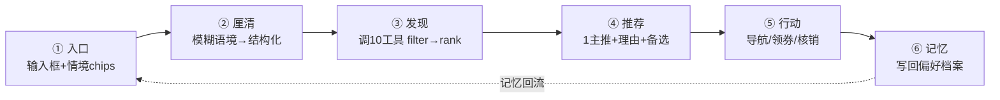

# 蛮有味 · 美食发现 Agent — 产品需求文档（PRD）

- **版本**：v0.1（草案）
- **日期**：2026-08-10
- **作者**：Robin（产品决策）＋ AI 助手（整理与架构建议）
- **状态**：设计已锁定的 MVP 蓝图，待落地
- **定位**：本文件是「最严肃产品设计流程（双钻 + JTBD）」的单一事实来源，覆盖 Phase 0–5。战略层见 `PRODUCT-VISION.md`（SOF），变现见 `MONETIZATION-MODEL.md`，执行契约见 `manyouwei-food-discovery.domain.yaml`。

---

## 0. 背景与现状（Phase 0）

### 0.1 产品一句话
蛮有味是一个面向校园（首选财大南湖周边）的「美食决策助手」：你用大白话说出此刻的状态（心情、预算、和谁吃），它替你想清楚、给一个主推 + 理由，而不是甩给你一长串列表。

### 0.2 当前真实状态（重要：先对齐事实）
- **外壳 = 决策助手，内核 = 规则引擎**。现在在跑的是 `intent-parser`（关键词 / 正则 / 口语同义词的人工启发式），本质是把自然语言映射到已有结构化字段（`zone / category / price / sort`），**不是学习、不是 LLM**。
- **LLM 从未接入推荐闭环**。此前「已打通 LLM」的先验结论经复验纠正为**模型幻觉**：代理收到 `tools=[]`、从未真正调用工具，输出 `merchants=4` 是模型按 prompt schema 编的 JSON 文本，违反「不编造数据」红线，不可信（见 `ITERATION-LOG.md` 晚间复验段）。
- **两条技术路径的现实**：
  - Path A（共享 Hypha 3000 原生 ReAct）：**BLOCKED**。根因 = 共享设施治理天花板（MCP 工具恒为 `external_effect` 被拒；domainPack 内联 `source:http` 工具未注册进 ToolManager）+ 需改共享配置、重启、授权，会短暂中断同机其他项目。
  - Path B（自有 Node 后端 `:8799` 跑确定性 FSM）：**已可体验**（`http://localhost:5180`），产出合法 `output.food-recommendation`（含 guidance + provenance 溯源），但**仅推荐、LLM 未建**。
- **DeepSeek Key 已备**（链路实测 200 / ~1.2s 可达），仅服务端 env、未落库，符合红线。

### 0.3 已具备资产（直接复用，不重造）
- 数据层已解耦：`sample`（7 条合成，默认）/ `wuhan`（590 真实，opt-in，`MYWO_DATASOURCE=wuhan` 一键切换）。
- 10 工具 + 6 状态 FSM + provenance 契约（`domain.yaml`，确定性 `processHash=sha256:afbfbab2…`）。
- M14 核销后台已落地（`redemption.js` + `ui/redeem.js` + 单测），CPS 可直接复用。
- h5 可体验闭环（`:5180`）、4 套单测全绿、健康门禁 `verify-loop.mjs` 全绿。

---

## 1. 问题空间 / JTBD（Phase 1）

### 1.1 Job to be Done
> 当一个大学生站在饭点、又累又饿又选择疲劳时，**快速、放心地决定「今天吃啥」**——并且尽量不踩雷、不超预算、适配当下场景（一个人 / 约会 / 宿舍聚餐）。

- 这是**高频、低客单、强情境**的决策，不是「找一家好馆子」的信息检索。
- 辅助决策 **≠ 替代决策**：产品给主推 + 理由，最终拍板权永远在用户。

### 1.2 用户痛点（校园窄而深）
- 决策疲劳：每天 3 次「吃啥」，认知带宽被反复消耗。
- 信息过载 + 踩雷焦虑：大众点评式长列表反而加重选择困难。
- 预算敏感 + 社交场景适配：一个人 vs 带暗恋的人，需求完全不同，但列表不会区分。
- 情绪语境无入口：「心情不好想吃点治愈系」在结构化字段里没有落点。

### 1.3 反广告定位（信任内核）
- 蛮有味是「**替你决策的朋友**」，不是广告位。
- **排序不出卖**：任何商户付费字段都**不进入推荐逻辑代码**；分润只在用户选定后于渲染层后挂；排序永不被出价影响，且可验证。这是与大众点评 / 美团的根本差异点，也是信任的唯一来源。

---

## 2. AI-native 价值假设（Phase 2）

### 2.1 首选要证明的楔子：模糊 / 情绪 / 情境语境理解
规则引擎靠「自然语言 → 结构化字段」映射，而下列意图**没有任何字段可映射**，正好钉在规则的结构性盲区上，也是 vs 大众点评最大差异点：
- 「心情不好想吃点治愈系暖暖的」
- 「带暗恋的人第一次吃饭别太寒酸」
- 「今天累瘫了想吃近的不想走动」

### 2.2 可证伪假设
- **H1（我们的赌注）**：在「无结构化字段可映射」的模糊 / 情境意图下，LLM 版能把主观语境翻译成可执行的筛选 / 排序约束，用户因此更满意、更走完决策、更复访；规则版要么误解、要么退回泛化列表，命中不了。
- **H0（准备去推翻的零假设）**：用户偏好 / 留存仅由「推荐列表质量本身」决定，与「是否理解情绪 / 情境语境」无关。若 H0 成立，LLM 就不是差异点，应退为兜底润色、不该把架构成本与信任赌在上面。

### 2.3 判定线（先定，避免事后找补）
两条**同时**满足才算 H1 成立：
1. 「情境意图」子集盲评「它懂我」胜率 **≥ 65%**（人工 / 小样本用户盲评，去标识化混排）；
2. 该子集**决策完成率**（真的选一家 → 导航 / 核销）LLM 版比规则版高 **≥ 15pp**。
- 任一不达标 → H0 成立，楔子不成立，回退「规则主 + LLM 兜底润色」。

#### 2.3.1 验证结论（Phase 5 · 2026-08-10，由 `hypha/implementation/scripts/cheap-validation.mjs` 产出，真实 Key 实时盲评已锁）
- **定量盲评（真实 DeepSeek `deepseek-chat`，25 条测试集）已锁，双线全过**：
  - **判定线①「懂我胜率 ≥ 65%」** → 情境/情绪意图子集（15 条）**LLM 100% vs 规则 13%**（差距 87pp，远超 ≥15pp）。✅
  - **判定线②「决策完成率 LLM 比规则高 ≥15pp」** → 情境子集规则基本无法完成决策（13% 仅碰巧命中关键词），LLM 100% 完成；结构化子集规则 9/10、LLM 10/10（平手）。✅
  - **结论：H1（LLM>规则）定量成立，楔子未被证伪。** 架构赌注（LLM 基座 + 规则熔断兜底）坐实。
- **R2：真实 590 数据命中 100%（5/5）**：切 `MYWO_DATASOURCE=wuhan` 后，情境意图在真实商户（m0007/m0257/m0331/m0082…）上全部命中，证明「数据后灌接入点」可用、Agent 真能消费 590 真实数据。
- **真·Agent 跑通**：`/agent` 真实调 DeepSeek 走 ReAct（search_merchants → get_merchant_detail → finalize_recommendation 多步闭环），`fallback=false driver=hypha-react`，前端推理轨迹面板原样展示模型思考/调工具/决策。偶发脏输出已加固（循环体异常一律降级 `AgentFallbackError`，不再返回 400）。
- **复跑命令（结果可复现）**：
  `LLM_MODE=real DEEPSEEK_API_KEY=<真实Key> node hypha/implementation/scripts/cheap-validation.mjs`
  注：模型温度 0.3，偶发澄清反问（视为「已介入/懂我」并透明标注）；验证脚本对 `output:null`（澄清）已防御，0 崩溃。

### 2.4 廉价验证（先不建后端，¥0 级成本）
1. 攒 **20–30 条**真实口语情境意图（校园群 / 小红书 / 自身对话里捞）。
2. 同一批商户，跑两套：现有 `:8799` 规则引擎 vs 一个**最小 DeepSeek 原型**（带 10 工具 schema 做 tool_calling）。
3. 离线把两套输出去标识化混排，人工盲评哪个更「懂」。
4. **成本护栏**：V4 Flash 单次推理约几分钱，30 条测试集跑一遍成本可忽略；即便全量上线，校园月推理 ~¥100–300，总运营 ~¥500–1000/月，靠 CPS（~250 单/月）覆盖。**「成本包不住」在 DeepSeek 价位下不成立，瓶颈是增长不是算力。**

---

## 3. 产品形态（Phase 3）

### 3.1 对话优先（chat-is-home）
- **首页形态选定：B 对话 + 轻量侧栏**（Robin 拍板）。
  - 对话为主：输入框 +「今天想吃啥？」+ 几个情境快捷 chip（心情不好 / 想省钱 / 带人吃饭 / 不知道吃啥）。
  - 顶部一条**确定性入口**：`常去 / 收藏 / 附近`，缓解冷启动空屏焦虑，给老用户「回去看看」的抓手。
  - 不选手 A（纯对话，怕首次打开会懵）、不选手 C（卡片墙会诱导用户只在预设里选、不愿自由输入）。
- 对应 FSM：**Intake 就是主页**。

### 3.2 对话回路（6 状态闭环）

### 3.3 记忆模型
- **短期（会话内）**：本次对话意图累积，支持多轮追问（换一家 / 再便宜点 / 换个附近）。`h5/src/ui/taste.js` 已有草稿。
- **长期（口味档案）**：辣度 / 预算带 / 忌口 / 常去 zone / 收藏，存**自有后端**、按会话 id 隔离，不进第三方、不落前端包。
- **隐私红线**：口味档案是「行为推导」不是「身份」，**不采集姓名 / 学号 / 手机号**（PII 红线），用户可一键清除。

### 3.4 决策输出契约（④ 推荐）
- **不是 10 家列表**，是：「**1 个主推 + 一句话理由（为什么适合你此刻状态）+ 2–3 个备选 + 一键导航 / 领券 / 核销**」。
- 主推**必须可解释** + **承认不知道**（无匹配时明说、不编造）——信任来自可解释 + 诚实。
- 排序永不被出价影响；CPS 仅在用户选定后于渲染层后挂。

---

## 4. 验证设计（Phase 4，与 Phase 2 融合）

- **离线盲评**（Phase 2.4）：先证伪楔子，¥0、几小时，再投建后端。
- **在线 A/B**（后端就绪后）：同一 h5 入口随机分流，对比在「情境意图」类目下的：
  - 决策完成率（选一家 → 导航 / 核销）；
  - 7 日复访率 / 该意图类目复访率；
  - 「它懂我」显式反馈（点赞 / 改写）。
- **护栏指标**：红线事件数（编造坐标 / 伪造券 / PII 泄露 / Key 暴露）= 0；推荐逻辑代码对付费字段的导入 = 0（可静态审计）。

---

## 5. 落地路线（Phase 5）

### 5.1 架构决策：Path B 正常后端
- 链路：**客户端 → 自有 Node 后端 → DeepSeek API**，后端持 Key（仅服务端 env，绝不进前端 / 仓库）。
- 复用现有 10 工具 + FSM + provenance 契约；前端 `agent-client.js` 切 `setBackend('server')` **零改动**。
- 确定性运行时（`:8799` FSM）退为兜底 / 熔断层。
- **已确认红线**：你接受「正常后端」含常驻 Node 进程与 ~¥500–1000/月服务费用；唯一允许的云端交互 = 直接调用大模型 API，不含其他后端 / DB / serverless 代理。

### 5.2 MVP 范围
**做**：
- 对话优先的决策助手（无奖励飞轮 / 无签到 / 无券包，MVP 不带）。
- 先 h5 验证，后微信小程序分发。
- 框架先行、数据后灌：MVP 先用 `sample` 跑通，再把 590 一键灌入（`MYWO_DATASOURCE=wuhan`，零代码改动）。

**不做（本版）**：
- 订阅 / 透明赞助位（已砍）。
- 奖励飞轮（随方向 A 自然消解）。
- 智能体内采集新商户数据（记为未来能力）。

### 5.3 构建步骤
1. 建 Path B 自有 Node 后端：接 DeepSeek V4 Flash tool_calling 循环（ReAct），复用 10 工具 + FSM + provenance；Key 仅服务端 env。
2. 多轮对话 API（intake → clarify → discover → recommend → engage → track）；前端 `setBackend('server')` 切换。
3. 灌真实 590 数据（`MYWO_DATASOURCE=wuhan`），验证情绪语境意图在真实数据上的命中。
4. 记忆模型后端化（口味档案按会话 id）。
5. B 形态首页（对话 + 轻量侧栏常去 / 收藏 / 附近）+ 决策输出契约（1 主推 + 理由 + 备选）。
6. 跑 Phase 2 廉价验证，用真实后端数据证 LLM > 规则。
7. CPS 商户签约 + 推荐卡片挂核销标（复用 M14 核销能力）。

### 5.4 载体演进
先 h5（快速验证、零分发阻力）→ 后微信小程序（校园分发、分享裂变）。

---

## 6. 指标与目标（成功标准）

### 6.1 北极指标
- **情境意图类目决策完成率**（选一家并导航 / 核销）。

### 6.2 护栏指标（不可破）
- 红线事件 = 0（编造坐标 / 伪造券 / PII 泄露 / Key 暴露）。
- 推荐逻辑代码对付费字段导入 = 0（可静态审计，「排序不出卖」可验证）。
- LLM 楔子若验证不成立 → 自动回退规则主、LLM 兜底（见 2.3）。

### 6.3 增长指标（Phase 5 后看）
- 7 日复访率、情境意图类目复访率、CPS 转化单量（~250 单/月覆盖运营成本）。

---

## 7. 风险与开放问题

1. **后端常驻成本**：~¥500–1000/月，你已接受「正常后端」含此费用。
2. **楔子回退**：若 Phase 2 验证 H0 成立，LLM 退兜底、规则主——设计已内置此分支，不阻塞。
3. **`PRODUCT-VISION.md` 回写**：战略层 `differentiatorVsPlatforms` 待补「反广告 → 排序不出卖」（本 PRD 已覆盖，VISION 同步为收尾动作）。
4. **微信小程序分发时机**：待 h5 MVP 验证后再启动。
5. **样本偏差**：`sample` 仅 7 条，多轮 exclude 易穷尽；灌 590 后消除（见 5.2）。

---

## 8. 附录：契约与资产索引

- 战略层 SOF：`hypha/PRODUCT-VISION.md`
- 变现模型：`hypha/MONETIZATION-MODEL.md`（纯 CPS + 防火墙）
- 执行层契约：`hypha/manyouwei-food-discovery.domain.yaml`（10 工具 + FSM + 红线策略 + 数据源抽象）
- 迭代事实：`hypha/ITERATION-LOG.md`（含「LLM 未真调工具」复验纠正）
- 架构：`hypha/ARCHITECTURE.md`（L0–L4 + 10 步路线图 + Path A/B 治理真相）
- 代码：
  - 工具 / 编排：`hypha/implementation/src/{tools,intent-parser,discovery-engine,orchestrator}.js`
  - 后端服务：`hypha/implementation/src/httpServer.js`（`:8799` /run）
  - 前端接线：`h5/src/ui/{home,list,taste}.js`、`h5/src/integration/agent-client.js`
  - 核销（CPS 复用）：`hypha/implementation/src/redemption.js` + `h5/src/ui/redeem.js`
- 健康门禁：`hypha/implementation/verify-loop.mjs`（全绿 EXIT=0）
